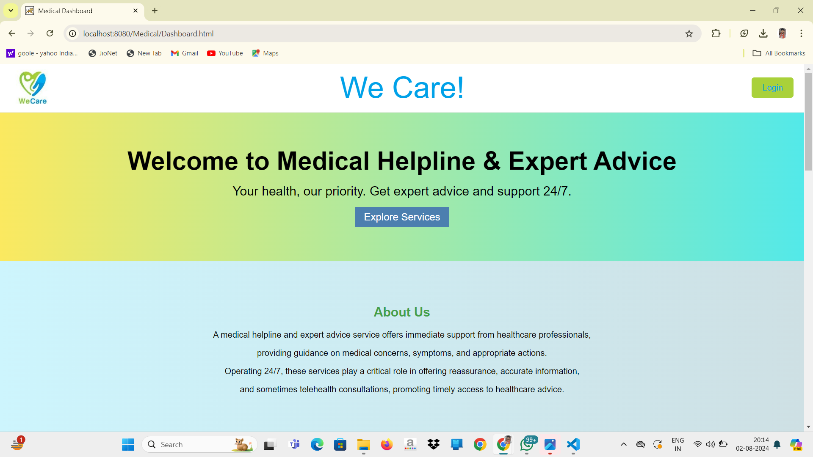

# Medical-Helpline-Expert-Advice

**Name:** Abhishek Kumar  

**Company:** ITM UNIVERSITY GWALIOR  

**Domain:** WEB DEVELOPMENT 

**Duration:** 03th JUNE 2024 TO 29TH JUNE 2024

# OUTPUT

## Project Overview ##
Introduction

This project was developed as part of my internship at Itm University Gwalior. It showcases my skills in HTML, CSS, JavaScript and Jdbc,Mysql through the creation of a [responsive web application, interactive user interface.].

# Features
**Responsive Design:** The application is fully responsive and works seamlessly across different devices.

**Interactive UI:** Utilizes JavaScript to create dynamic and interactive user experiences.

**Modern CSS:** Implements modern CSS techniques for styling and layout.

# Technologies Used
**Frontend :-**
**HTML:** 1.For structuring the content on the web pages.

**CSS:** 1.For styling and layout of the web pages.

**JavaScript:** 1.For adding interactivity and dynamic behavior to the web pages.

**Backend :-**

**JDBC :** 1.Use JDBC to connect your Java application to the MySQL database.
           2.Perform database operations like querying, updating, and managing data.

**Mysql :** 1.Use MySQL as your database management system to store and manage data.
            
# Usage
Open Dashboard.html to see the project in action.

Navigate through the pages and interact with the UI to explore all the features.
# Acknowledgments

Special thanks to ITM UNIVERSITY GWALIOR for the opportunity and guidance throughout the internship.
